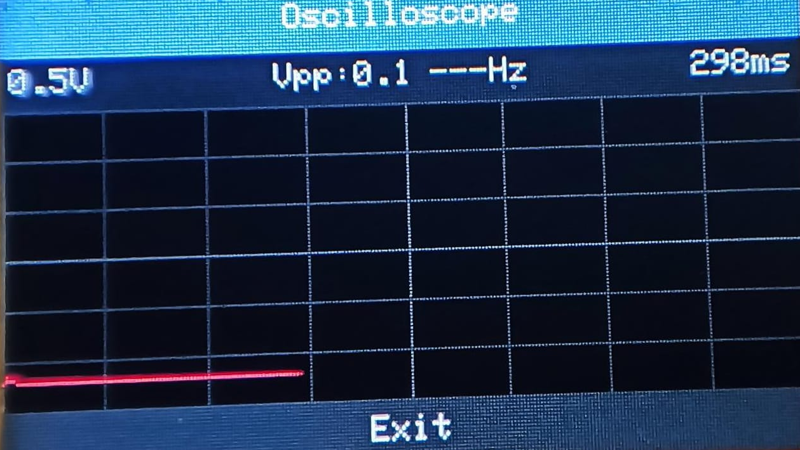

# M5BruceOscilloscope - v1.0

**Author:** YahyaSvm , takagi-1
**Target Firmware:** [Bruce Firmware by pr3y](https://github.com/pr3y/Bruce)
**Version:** 1.0 (Release Date: 5.9.2025) 
**Languages:** [English](./README.md) | [Türkçe](./README_tr.md)

A JavaScript-based oscilloscope application specifically designed for M5Stack devices running **Bruce Firmware**. This project aims to provide a functional oscilloscope experience directly on the M5Stack using the capabilities of the Bruce environment.

 

## Features (v1.0)

*   Targets **Bruce Firmware** by pr3y.
*   Dual Channel Display (CH2 can be disabled).
*   Adjustable Time/Pixel (Horizontal sweep speed).
*   Adjustable Volts/Div (Vertical sensitivity).
*   Vpp (Peak-to-Peak) Measurement for the selected channel.
*   Frequency Measurement (Basic) for the selected channel.
*   Selectable Measurement Channel (CH1 or CH2).
*   Configurable Trigger Edge (Rising or Falling).
*   Menu-Driven Interface with Scrolling for easy navigation.
*   Dedicated Safety Information Screen with scrolling text.
*   Configurable Button Layout (defaults set for M5StickC-like devices).

## !!! IMPORTANT SAFETY WARNINGS !!!

*   **RISK OF DAMAGE TO YOUR M5STACK:**
    *   **VOLTAGE LIMITS:** The ADC pins on M5Stack devices have a **MAXIMUM INPUT VOLTAGE (typically 0V to 3.3V)**. Refer to your specific M5Stack model and Bruce Firmware documentation for precise ADC limits.
    *   **NEVER CONNECT VOLTAGES EXCEEDING THESE LIMITS DIRECTLY.** Doing so will very likely cause **PERMANENT DAMAGE**.
*   **MEASURING HIGHER VOLTAGES OR AC SIGNALS:**
    *   Use a **VOLTAGE DIVIDER CIRCUIT** for voltages greater than the ADC's safe input range.
    *   For AC signals, use appropriate conditioning circuitry (DC offset, clamping diodes).
*   **PIN VERIFICATION (CRITICAL):**
    *   Before running, **VERIFY AND CORRECT** the `BTN_M5_SELECT_EXIT_PIN`, `BTN_NAV_UP_PIN`, `BTN_NAV_DOWN_PIN`, `CH1_PIN`, and `CH2_PIN` constants at the top of the `M5BruceOscilloscope_v1.0.js` file to match **YOUR SPECIFIC M5Stack model's GPIOs as recognized by Bruce Firmware**. Incorrect pin assignments will lead to unresponsive controls or malfunction.
*   **EXPERIMENTAL SOFTWARE:**
    *   Use this software at **YOUR OWN RISK**. The developer (YahyaSvm) is not responsible for any damage.

## Hardware Requirements

*   M5Stack Device (e.g., M5StickC, M5StickC Plus, M5Stack Core2)
*   **Firmware:** [Bruce Firmware by pr3y](https://github.com/pr3y/Bruce) must be installed and running.
*   **Buttons:**
    *   **M5 Button (Front/Side):** Select / Change Value / Exit (Default: GPIO 37)
    *   **Top Button:** Navigate Up / Previous Item (Default: GPIO 39)
    *   **Bottom Button (if available):** Navigate Down / Next Item (Default: GPIO 35)
    *   *(Verify these against your M5Stack model and Bruce Firmware's GPIO mapping)*
*   **Analog Inputs:** Two ADC-capable pins (Defaults: GPIO 32, GPIO 33)
    *   *(Verify these against your M5Stack model and Bruce Firmware's ADC pin availability)*

## Setup and Configuration

1.  **Install Bruce Firmware:** Ensure [Bruce Firmware](https://github.com/pr3y/Bruce) is installed on your M5Stack device.
2.  **Configure Pins:** Open `M5BruceOscilloscope_v1.0.js` and **carefully set the GPIO pin numbers** for your buttons and ADC inputs at the top of the file, according to how Bruce Firmware recognizes them on your specific M5Stack model.
3.  **Character Width:** Adjust `CHAR_WIDTH_PX` (default: `6`) in the script if text alignment is off on your device's screen with Bruce Firmware's font.
4.  **Load Script:**
    *   Transfer the `M5BruceOscilloscope_v1.0.js` file to your M5Stack (e.g., via SD card if Bruce supports it, or by pasting into Bruce's REPL/IDE).
    *   Execute the script within the Bruce Firmware environment.

## Usage (Button Layout v1.0)

*   **M5 Button (Front/Side):**
    *   **Menus:** Select highlighted item.
    *   **Settings Menu:** Change value of selected setting / Select "Back" item to exit Settings.
    *   **Oscilloscope/About/Safety Screens:** Exit to previous menu.
*   **Top Button:**
    *   **Menus:** Navigate UP (select previous item).
    *   **Safety Info Screen:** Scroll text UP.
*   **Bottom Button:**
    *   **Menus:** Navigate DOWN (select next item).
    *   **Safety Info Screen:** Scroll text DOWN.

## Changelog (v1.0)

*   Initial public release for Bruce Firmware.
*   Implemented scrolling for menus and safety information.
*   Revised button control scheme for intuitive navigation.
*   Added comprehensive safety warnings.
*   Core oscilloscope functionalities: dual channel (optional), Vpp, Freq, Time/Div, Volt/Div.

## Known Issues / Limitations

*   This script is tailored for the JavaScript environment provided by Bruce Firmware. Compatibility with other M5Stack firmwares (e.g., UIFlow, Arduino, standard Espruino) is not guaranteed.
*   Performance for very high-frequency signals might be limited by the JavaScript execution speed within Bruce.
*   The `digitalRead()` behavior and `pinMode()` options might differ slightly in Bruce compared to other environments; the current implementation assumes standard behavior.

## Future Ideas

*   AC/DC Coupling (would require hardware interface and software logic).
*   More advanced trigger modes (Normal, Auto, Single).
*   Saving/Loading settings (if Bruce provides a filesystem API).

## Contributing

Contributions, issues, and feature requests are welcome!

## License

This project is licensed under the [MIT License](./LICENSE).
