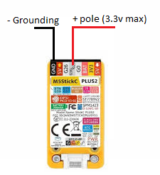

# M5BruceOscilloscope - v1.5

**Author:** YahyaSvm, takagi-1
**Target Firmware:** [Bruce Firmware by pr3y](https://github.com/pr3y/Bruce)
**Version:** 1.5 (Release Date: 2024-07-29)
**Languages:** [English](./README.md) | [Türkçe](./README_tr.md)

A JavaScript-based oscilloscope application specifically designed for M5Stack devices running **Bruce Firmware**. This project aims to provide a functional oscilloscope experience directly on the M5Stack using the capabilities of the Bruce environment.

## Features (v1.5)

*   Targets **Bruce Firmware** by pr3y.
*   Dual Channel Display (CH2 disabled by default).
*   Adjustable Time/Pixel (Horizontal sweep speed).
*   Adjustable Volts/Div (Vertical sensitivity).
*   Adjustable Trigger Level (selectable percentages: 10%, 25%, 50%, 75%, 90%).
*   Vpp (Peak-to-Peak) Measurement for the selected channel.
*   Frequency Measurement (Basic) for the selected channel.
*   Selectable Measurement Channel (CH1 or CH2).
*   Configurable Trigger Edge (Rising or Falling).
*   Scrolling Menu-Driven Interface.
*   Dedicated Safety Information Screen with scrolling text.
*   Configurable Button Layout.
*   Heuristic USB/Charging Detection & Warning (Experimental, now non-blocking with 'Proceed' option).
*   **NEW (v1.4): Enhanced Oscilloscope Pause Functionality:**
    *   When "Pause" is pressed, the current waveform on screen is **instantly frozen**.
    *   Vpp and Frequency values at the moment of pause are displayed on the info bar.
    *   "PAUSED" message is drawn over the frozen graph with its own small background for better readability.
    *   Footer updates to "Resume".
*   **NEW (v1.4): Charging Advisory Button Update:**
    *   The "OK (Kapat)" button on the charging advisory screen has been changed to just "OK".

## !!! IMPORTANT SAFETY WARNINGS !!!

*   **RISK OF DAMAGE TO YOUR M5STACK:**
    *   **VOLTAGE LIMITS:** The ADC pins on M5Stack devices have a **MAXIMUM INPUT VOLTAGE (typically 0V to 3.3V)**. Refer to your specific M5Stack model and Bruce Firmware documentation for precise ADC limits.
    *   **NEVER CONNECT VOLTAGES EXCEEDING THESE LIMITS DIRECTLY.** Doing so will very likely cause **PERMANENT DAMAGE**.
*   **MEASURING HIGHER VOLTAGES OR AC SIGNALS:**
    *   Use a **VOLTAGE DIVIDER CIRCUIT** for voltages greater than the ADC's safe input range.
    *   For AC signals, use appropriate conditioning circuitry (DC offset, clamping diodes).
*   **PIN VERIFICATION (CRITICAL):**
    *   Before running, **VERIFY AND CORRECT** the `BTN_M5_SELECT_EXIT_PIN`, `BTN_NAV_UP_PIN`, `BTN_NAV_DOWN_PIN`, `CH1_PIN`, `CH2_PIN`, and `USB_DETECT_PIN` (if used) constants at the top of the `M5BruceOscilloscope_v1.4.js` (or current version) file to match **YOUR SPECIFIC M5Stack model's GPIOs as recognized by Bruce Firmware**. Incorrect pin assignments will lead to unresponsive controls or malfunction.
*   **USB POWER INTERFERENCE:**
    *   Connecting the M5Stack to USB power (for charging or data) can introduce significant noise or affect ADC readings, making accurate oscilloscope measurements difficult or impossible.
    *   This application includes a heuristic to detect potential USB power connection and will display a warning. **For reliable measurements, disconnect the USB cable from the M5Stack before starting the oscilloscope.**
    *   The USB detection heuristic is **NOT PERFECT** and might give false positives or negatives depending on your hardware and the probes connected. Do not solely rely on it; always disconnect USB power for best results.
*   **EXPERIMENTAL SOFTWARE:**
    *   Use this software at **YOUR OWN RISK**. The developers (YahyaSvm, takagi-1) are not responsible for any damage.

## Hardware Requirements

*   M5Stack Device (e.g., M5StickC, M5StickC Plus, M5Stack Core2)
*   **Firmware:** [Bruce Firmware by pr3y](https://github.com/pr3y/Bruce) must be installed and running.
*   **Buttons:** (Verify against your M5Stack model with the constants at the top of the script)
    *   **M5 Button (Front/Side):** Select / Change Value / Exit (Default: GPIO 37)
    *   **Top Button:** Navigate Up / Previous Item / Pause/Resume in Scope (Default: GPIO 35)
    *   **Bottom Button (if available):** Navigate Down / Next Item (Default: GPIO 39)
*   **Analog Inputs:** Two ADC-capable pins (Verify against your M5Stack model with the constants at the top of the script. Defaults: CH1_PIN=36, CH2_PIN=25)
*   **Battery ADC Pin (optional, for heuristic charging detection):** (Default: BATTERY_ADC_PIN=38)

## Setup and Configuration

1.  **Install Bruce Firmware:** Ensure [Bruce Firmware](https://github.com/pr3y/Bruce) is installed on your M5Stack device.
2.  **Configure Pins:** Open `M5BruceOscilloscope_v1.5.js` (or current version) and **carefully set the GPIO pin numbers** for your buttons, ADC inputs, and battery pin (if used) at the top of the file, according to how Bruce Firmware recognizes them on your specific M5Stack model.
3.  **Character Width:** Adjust `CHAR_WIDTH_PX` (default: `6`) in the script if text alignment is off on your device's screen with Bruce Firmware's font.
4.  **Load Script:**
    *   Transfer the `M5BruceOscilloscope_v1.5.js` file to your M5Stack (e.g., via SD card if Bruce supports it, or by pasting into Bruce's REPL/IDE).
    *   Execute the script within the Bruce Firmware environment.

## Usage (Button Layout)

*   **M5 Button (Front/Side - Typically GPIO 37):**
    *   **Menus:** Select highlighted item.
    *   **Settings Menu:** Change value of selected setting / Select "Back" item to exit Settings.
    *   **Oscilloscope/About/Safety Screens:** Exit to previous menu.
    *   **USB Warning Screen:** Select "Menu" to return to the main menu.
*   **Top Button (Typically GPIO 35 on M5StickC, or as assigned by you):**
    *   **Menus:** Navigate UP (select previous item).
    *   **Oscilloscope Screen:** Pause / Resume.
    *   **Safety Info Screen:** Scroll text UP.
    *   **USB Warning Screen:** Select "Proceed" to continue to the oscilloscope.
*   **Bottom Button (Typically GPIO 39 on M5StickC, or as assigned by you):**
    *   **Menus:** Navigate DOWN (select next item).
    *   **Safety Info Screen:** Scroll text DOWN.

## Changelog

*   **v1.5 (2024-07-29):**
    *   Implemented Adjustable Trigger Level (selectable percentages via settings).
    *   Modified USB/Charging warning to be non-blocking with a 'Proceed' option and timeout.
    *   Refined 'Measure Channel' selection logic in settings for better usability.
    *   Internal refactoring of `oscilloscopeScreen` for improved code structure.
*   **v1.4 (2025-11-5):**
    *   Added Enhanced Oscilloscope Pause: Instant waveform freeze, Vpp/Frequency display at pause.
    *   Updated charging advisory button text to "OK".
    *   Minor code structure improvements (resetSweepState function).
*   **v1.3 (2025-10-5):**
    *   Added basic Pause/Resume button to oscilloscope screen.
    *   Improved scrolling menu interface.
    *   Added heuristic USB/Charging detection and warning.
    *   Added Takagi-1 as co-developer.

## Known Issues / Limitations

*   This script is tailored for the JavaScript environment provided by Bruce Firmware. Compatibility with other M5Stack firmwares (e.g., UIFlow, Arduino, standard Espruino) is not guaranteed.
*   Performance for very high-frequency signals might be limited by the JavaScript execution speed within Bruce.
*   The USB/Charging detection is a heuristic based on ADC pin state and may not be 100% reliable across all M5Stack models or scenarios.
*   The `digitalRead()` behavior and `pinMode()` options might differ slightly in Bruce compared to other environments; the current implementation assumes standard behavior.

## Future Ideas

*   AC/DC Coupling (would require hardware interface and software logic).
*   More advanced trigger modes (Normal, Auto, Single).
*   Saving/Loading settings (if Bruce provides a filesystem API).

## Contributing

Contributions, issues, and feature requests are welcome!

## License

This project is licensed under the [MIT License](./LICENSE).
